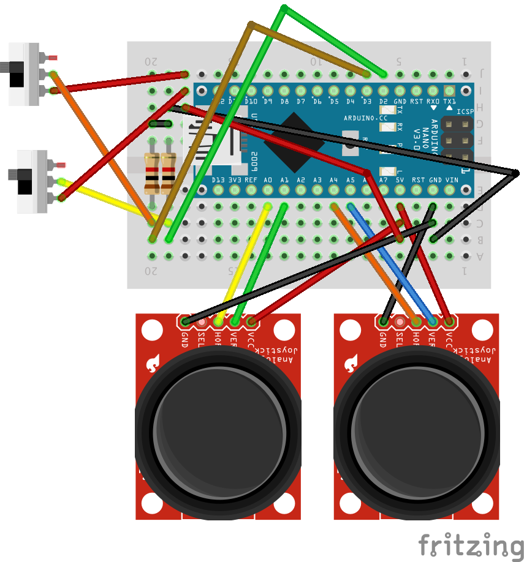

SimplonDrone
========

#### Lancement du programme
```js
npm install // Installation des dépendences
node app.js // Lancement du programme
```

#### Consommables:
* Drone Parrot AR 2.0
* Fils de connections
* Plaque de prototypage
* 2 joysticks
* 2 interrupteurs
* Arduino nano
* RaspberryPi
* 2 Résistances
* Dongle WiFi
* Circuit de charge 5V
* Alimentation 5v (chargeur micro/mini usb)
* Batterie 3.7V (minimium 2000 mAh)
* Bobine PLA (pour le boitier)
* Etain
* Visserie

#### Outils:
* Imprimante 3D
* Fer à souder

#### Câblage:

* Joystick altitude gauche
  * Axe X: A0
  * Axe Y: A1
* Joystick directionnelle droite
  * Axe X: A4
  * Axe Y: A5
* Interrupteur On/Off
  * Pin: 2
* Interrupteur décollage attérisage
  * Pin: 3


